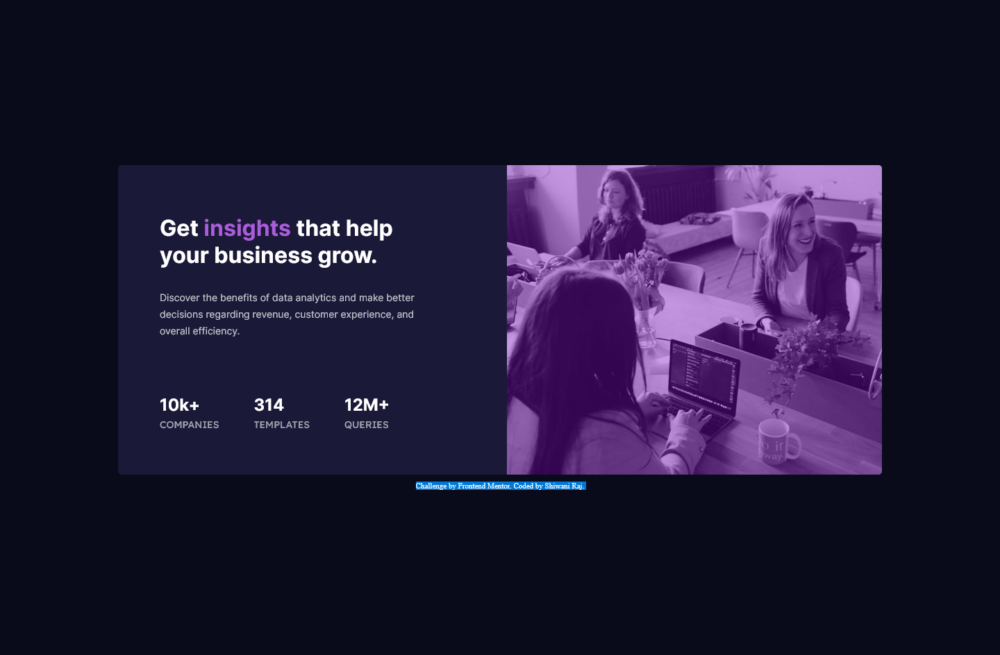

# Frontend Mentor - Stats preview card component solution

Frontend Mentor challenges help you improve your coding skills by building realistic projects. 

## Table of contents

- [Overview](#overview)
  - [The challenge](#the-challenge)
  - [Screenshot](#screenshot)
  - [Links](#links)
- [My process](#my-process)
  - [Built with](#built-with)
  - [What I learned](#what-i-learned)
  - [Useful resources](#useful-resources)
- [Author](#author)
- [Acknowledgments](#acknowledgments)

## Overview
This project is a good start to using and enhancing one's HTML and CSS skills. The overall experience of doing this project is quite good.
### The challenge

Users should be able to:

View the optimal layout depending on their device's screen size
See hover and focus states for interactive elements
Screenshot

### Screenshot

### Links

- Solution URL:(https://github.com/cwaniraj149/Frontend-Mentor-Stats-preview-card-component)
- Live Site URL:(https://cwaniraj149.github.io/Frontend-Mentor-Stats-preview-card-component/)

## My process

### Built with

- Semantic HTML5 markup
- CSS custom properties
- Flexbox
- Mobile-first workflow

### What I learned

I was just revising my old concepts through this project.

### Useful resources

freeCodeCamp.org - This CSS explanation is very good and helped me to understand the concept of Flexbox. I'd recommend it to anyone still learning this concept.

w3schools - This amazing site helped me revise concepts while doing this project.

## Author

- Frontend Mentor - [@cwaniraj149](https://www.frontendmentor.io/profile/cwaniraj149)

## Acknowledgments

Thanks to Jad Khalili and freeCodeCamp.org for providing such an amazing lecture on CSS. I learned many things from him, which I used while doing this project.

## Got feedback for me?

I love receiving feedback! I'm always looking to improve my project and enhance my knowledge. So if you have anything you'd like to mention, please comment.

Had fun building! 🚀