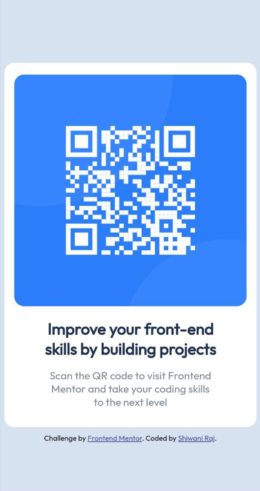

# Frontend Mentor - QR code component Solution
[Frontend Mentor](https://www.frontendmentor.io) challenges help you improve your coding skills by building realistic projects.

## Welcome! 👋 

My task was to build out the project to the designs inside the `/design` folder. You will find both a mobile and a desktop version of the design. 

Here is my destop preview of this project - 


Here is my mobile preview of this project - 



## Table of contents

- [Overview]
  - [Screenshot]
  - [Links]
- [My process]
  - [Built with]
  - [What I learned]
  - [Useful resources]
- [Author]
- [Acknowledgments]

## Overview
This project is a good start to using and enhancing one's HTML and CSS skills. The overall experience of doing this project is quite good.

### Screenshot
Here is my destop preview of this project - 

Here is my mobile preview of this project - 

### Links

- Solution URL: [Add solution URL here](https://your-solution-url.com)
- Live Site URL: [Add live site URL here](https://your-live-site-url.com)

## My process

### Built with

- Semantic HTML5 markup
- CSS custom properties
- Flexbox


### What I learned

Basically, through this project, I learned about Flexbox.

```html
<h1>Some HTML code I'm proud of</h1>
```
```css
.proud-of-this-css {
  display:flex;
  flex-direction: row; /*flex-direction is row by default. Another value is column.*/
   justify-content: center;  /* Values: flex-start, flex-end, space-around and space-between. */
  align-items: center; /* Values: flex-start, flex-end, stretch and baseline */
}
```
```

### Useful resources

- [freeCodeCamp.org](https://www.youtube.com/watch?v=1Rs2ND1ryYc&t=12479s) - This CSS explanation is very good and helped me to understand the concept of Flexbox. I'd recommend it to anyone still learning this concept.

- [w3schools](https://www.w3schools.com/) - This amazing site helped me revise concepts while doing this project.


## Author

- Website - [Shiwani Raj](https://cwaniraj149.github.io/personal-website/)
- Frontend Mentor - [@cwaniraj149](https://www.frontendmentor.io/profile/cwaniraj149)


## Acknowledgments

Thanks to Jad Khalili and freeCodeCamp.org for providing such an amazing lecture on CSS. I learned many things from him, which I used while doing this project.

## Got feedback for me?

I love receiving feedback! I'm always looking to improve my project and enhance my knowledge. So if you have anything you'd like to mention, please comment.

**Have fun building!** 🚀
