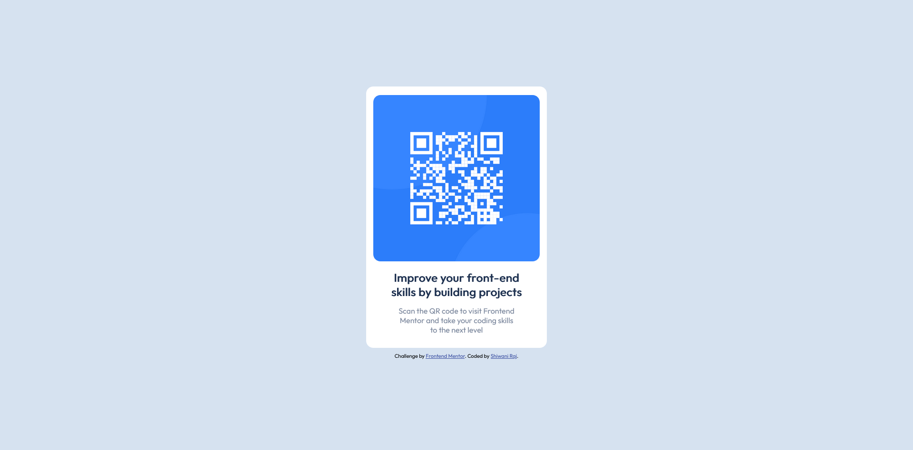
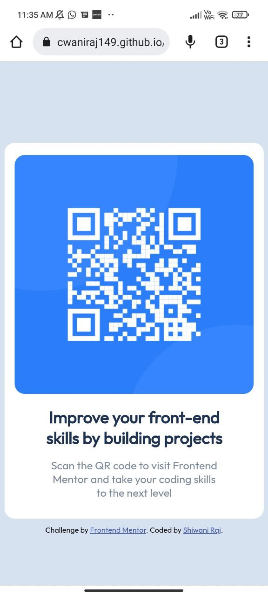

# Frontend Mentor - QR-code-component
[Frontend Mentor](https://www.frontendmentor.io) challenges help you improve your coding skills by building realistic projects. Frontend Mentor challenge to build out this product preview card component and get it looking as close to the design as possible.


## Welcome! 👋 

My task was to build out this project to the designs inside the `/design` folder and get it looking as close to the design as possible.  

## Table of contents

- [Overview]
  - [Screenshot]
  - [Links]
- [My process]
  - [Built with]
  - [What I learned]
  - [Useful resources]
- [Author]
- [Acknowledgments]

## Overview
This project is a good start to using and enhancing one's HTML and CSS skills. The overall experience of doing this project is quite good.

### The challenge

Users should be able to:

- View the optimal layout depending on their device's screen size
- See hover and focus states for interactive elements


### Screenshot
Here is my destop preview of this project - 


Here is my mobile preview of this project - 


You can find both these previews inside the `/mydesign` folder.

### Links

- Solution URL: [https://github.com/cwaniraj149/Frontend-Mentor-QR-code-component]
- Live Site URL: [https://cwaniraj149.github.io/Frontend-Mentor-QR-code-component/]

## My process

Using HTML and CSS I designed this project. This project was quite simple and easy. As the actual dimensions of image and other few minor details were not provided so I assumed it by myself.  

### Built with

- HTML
- CSS 
- Resposnive


### What I learned

Basically, through this project, I learned about Flexbox.


```css
.proud-of-this-css {
  display:flex;
  flex-direction: row; /*flex-direction is row by default. Another value is column.*/
   justify-content: center;  /* Values: flex-start, flex-end, space-around and space-between. */
  align-items: center; /* Values: flex-start, flex-end, stretch and baseline */
}
```

### Useful resources

- [freeCodeCamp.org](https://www.youtube.com/watch?v=1Rs2ND1ryYc&t=12479s) - This CSS explanation is very good and helped me to understand the concept of Flexbox. I'd recommend it to anyone still learning this concept.

- [w3schools](https://www.w3schools.com/) - This amazing site helped me revise concepts while doing this project.


## Author

- Website - [Shiwani Raj](https://cwaniraj149.github.io/personal-website/)
- Frontend Mentor - [@cwaniraj149](https://www.frontendmentor.io/profile/cwaniraj149)


## Acknowledgments

Thanks to Jad Khalili and freeCodeCamp.org for providing such an amazing lecture on CSS. I learned many things from him, which I used while doing this project.


## Got feedback for me?

I love receiving feedback! I'm always looking to improve my project and enhance my knowledge. So if you have anything you'd like to mention, please comment.

**Had fun building!** 🚀
