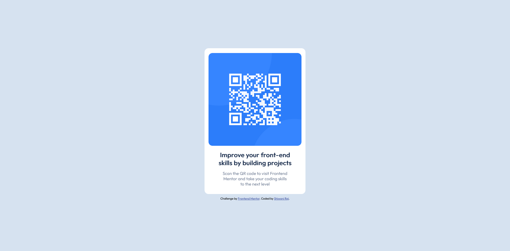

# Frontend Mentor - QR code component

## Welcome! 👋

[Frontend Mentor](https://www.frontendmentor.io) challenges help you improve your coding skills by building realistic projects.

My task was to build out the project to the designs inside the `/design` folder. You will find both a mobile and a desktop version of the design. 

The more specific you are with your questions the more likely it is that another member of the community will give you feedback.

## Got feedback for me?

I love receiving feedback! I'm always looking to improve my project and enhance my knowledge. So if you have anything you'd like to mention, please comment.

**Have fun building!** 🚀
